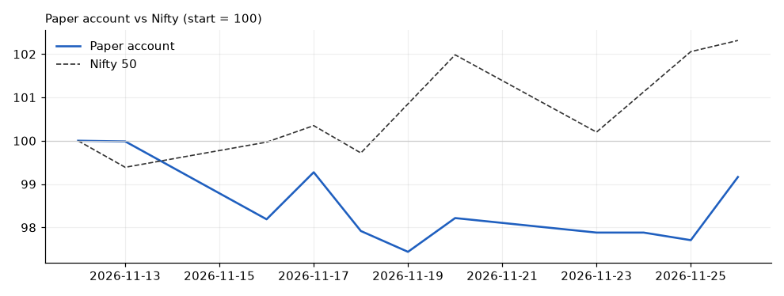
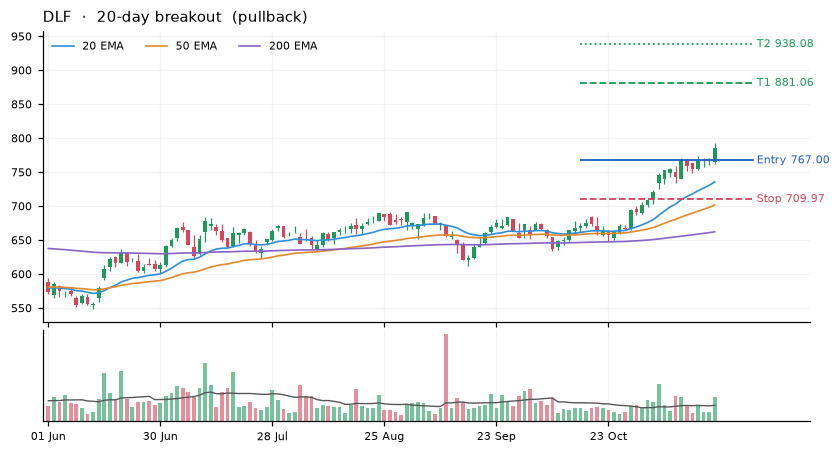

# v5 Paper Trading: Wednesday 25 Nov 2026

_Updated automatically 26 Nov 2026 22:24 UTC · version **v5 core** · started 12 Nov 2026_

**Equity ₹97,706** (-2.29%) · Nifty since start +2.05% · open positions 4 · closed trades 2 · win rate 0% · max drawdown -2.6%

Market breadth 69% → trend strategies **OFF**

## Orders for the next session (buy at the open)

_None._

## Open positions

| Stock | Strategy | Filled | Qty | Fill | Last | Stop | Return % | P&L ₹ | Days left | Exit watch |
|---|---|---|---|---|---|---|---|---|---|---|
| BHEL | EMA 10/30 crossover | 13 Nov | 38 | 427.80 | 413.50 | 391.44 | -3.34 | -564.00 | 52 | EMA10 423.25 vs EMA30 421.38 |
| DLF | 20-day breakout | 13 Nov | 21 | 767.00 | 795.00 | 709.97 | 3.65 | 568.00 | 52 | sells on a close below 734.15 (10-day low) |
| OBEROIRLTY | 20-day breakout | 13 Nov | 9 | 1,821.80 | 1,868.50 | 1,667.27 | 2.56 | 400.00 | 52 | sells on a close below 1733.10 (10-day low) |
| LODHA | 20-day breakout | 13 Nov | 11 | 1,224.10 | 1,202.00 | 1,089.64 | -1.81 | -260.00 | 52 | sells on a close below 1161.60 (10-day low) |

## Health check vs backtest

| Strategy | Closed trades | Win % | Expected win % | Avg R | P&L ₹ | Health |
|---|---|---|---|---|---|---|
| 20-day breakout | 2 | 0.00 | 35–46 | -0.88 | -2,516.00 | too early (2/20 trades) |

## Recent closed trades

| Stock | Strategy | Filled | Exited | Exit type | Return % | R | P&L ₹ |
|---|---|---|---|---|---|---|---|
| PAYTM | 20-day breakout | 13 Nov 26 | 19 Nov 26 | Stop | -10.60 | -1.02 | -1,425.00 |
| SAIL | 20-day breakout | 13 Nov 26 | 18 Nov 26 | Exit rule | -7.44 | -0.73 | -1,091.00 |

## Charts
**BHEL**

**DLF**

**OBEROIRLTY**

**LODHA**

## Data notes
- VEDL: 2026-04-30 overnight change -63%, treated as a corporate action and back-adjusted
- TMPV: one-day move over 25% on 2025-10-14 (40%). Check for a split/bonus or bad data.
- TRENT: one-day move over 25% on 2026-01-01 (33%). Check for a split/bonus or bad data.
- POLICYBZR: one-day move over 25% on 2026-09-24 (36%). Check for a split/bonus or bad data.
- Not downloaded: LTIM

_Paper trading only. Not investment advice._
